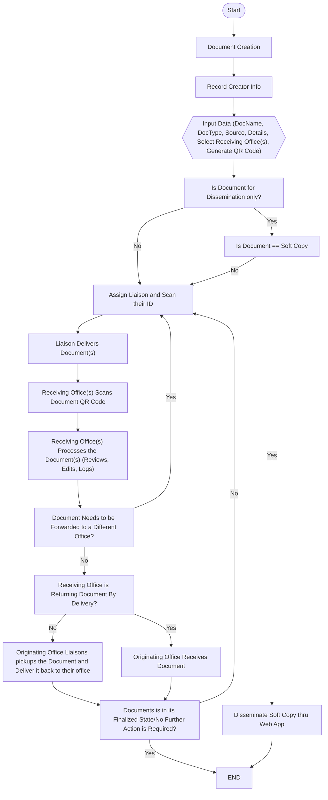
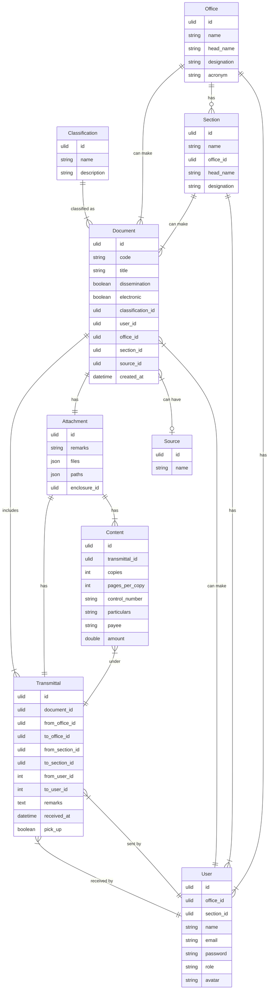

  

## Envoyr System Overview

Envoyr is a modern document tracking system designed to streamline how organizations manage, trace, and verify physical or digital documents throughout their lifecycle. Built with simplicity and efficiency in mind, Envoyr integrates powerful features like QR code generation, real-time location tracking, and detailed status updates to ensure complete visibility and accountability.

Whether you're handling sensitive legal paperwork, internal memos, or high-volume correspondence, Envoyr provides a secure, centralized platform to monitor movement, prevent loss, and maintain records with confidence.

Key Features:

📦 Document Journey Tracking: Visualize every stop in a document’s path—from sender to recipient.

🔐 Secure QR Codes: Attach smart QR codes to documents for instant access and authentication.

🌓 Dark/Light Mode: Seamless user experience with theme switching for comfort and accessibility.

🛠️ Built with: HTML, Tailwind CSS, Font Awesome, and a modern tech stack.

Envoyr is ideal for businesses, government agencies, schools, or anyone needing reliable document movement control—bringing peace of mind and precision to paper trails.

## How Envoyr Works?

1. QR Code Generation:
The originating office generates a unique QR code and attaches it to the document. This code serves as the primary means of tracking the document's journey.

2. Assigning a Destination Office:
The system or sender assigns the intended receiving office where the document should be delivered.

3. QR Code Scanning:
Upon receipt, the receiving office scans the document’s QR code. This action logs the location and confirms the document’s arrival at the designated office.

4. System Notification:
The system sends a real-time notification to registered users, indicating where and when the document was last scanned.

5. Receiving Office Decision:
The receiving office evaluates the document and decides:

    To return it via official delivery, or

    To hold it for pickup by the originating office or another party.

6. Final Document Receipt:
The document completes its journey when it is successfully returned or picked up by the original creator or authorized recipient.

## Flowchart

## ER Diagram

